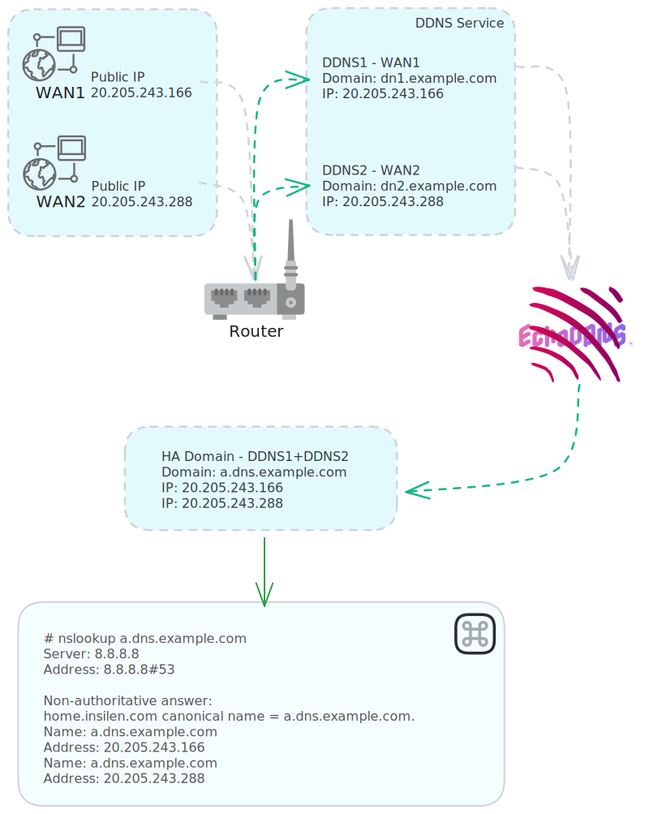

<p align="center">
  
</p>


<p align="center">
  🚀🚀DDNS场景的高可用解析方案🚀🚀
</p>


## 项目概述

在动态IP(宽带)接入环境下解析的DDNS(动态域名)可用性会受到各种因素影响导致可用性很低，该项目使用域名解析中的A记录高可用方式来提升DDNS(动态域名)下服务的可用性。

> 使用该项目**硬性门槛**是您的公网IP数量 ≥2(大于等于2)
>
> 超轻量仅需配置 1CPU / 64MB RAM / 100MB DISK 即可稳定运行

## 支持情况

支持设置的域名(开发计划)

- [x] 阿里云解析
- [ ] 腾讯云DNSpod
- [ ] 3322.org
- [ ] oray.com
- [ ] 华为云域名
- [ ] cloudflare.com
- [ ] 自由模式(自定义DNS查询)

支持的运行的环境
- [x] Linux/Win/macOS AMD64/ARM64 Python3
- [x] Docker Cli/Docker Compose


## 原理流程图

<p align="center">
  
</p>


## 运行条件

- 公网IP/宽带 数量≥2(大于等于2)
- 路由/网关/或其他方式 已经解析好每条线路对应的DDNS域名 本项目不提供DDNS服务
- 一台能运行Python或Docker的服务器/盒子/NAS

 

## 快速开始

本项目提供了快速启动的Docker镜像 访问 https://hub.docker.com/r/insilen/aliddnstoa 获取


使用Docker Compose直接运行，配置的环境变量如下
```
- "ACCESSKEY_ID=<HIDE>"        # 阿里云 AK 访问https://ram.console.aliyun.com/users/ 创建用户并授AliyunDNSFullAccess权限
- "ACCESSKEY_SECRET=<HIDE>"    # 阿里云 AK
- "DOMAIN_TTL=60"              # 高可用解析 TTL 不添加此行则为600 可选60,120,600,1800,3600,36000,86400
- "DOMAIN_NAME=example.com"         # 需要操作的主域名
- "DDNS1_DOMAIN=dns1.example.com"   # DDNS域名1(源)
- "DDNS2_DOMAIN=dns2.example.com"   # DDNS域名2(源)
- "A_DOMAIN=a.dns.example.com"      # 所有DDNS IP 最终解析的简单高可用域名
- "A_RecordId1=1234"           # 最终解析的域名的RecordId 访问https://next.api.aliyun.com/api/Alidns/2015-01-09/DescribeSubDomainRecords 查询获取
- "A_RecordId2=1235"           
```

注意其中的 DOMAIN_TTL 如果你没有购买企业版DNS TTL 1分钟版本，那么建议直接删除`- "DOMAIN_TTL=60"` 整行配置，就会使用默认的600（10分钟）参数

配置例子:
```
主域名: example.com
DDNSIP数量: 3个 IP:10.0.0.10  10.0.0.20  10.0.0.30
DDNS1域名: dns1.example.com 10.0.0.10
DDNS2域名: dns2.example.com 10.0.0.20
DDNS3域名: dns3.example.com 10.0.0.30
```
假设以上部分已经从你的网关或路由中实现了功能，那么久能顺利的利用本项目来继续实现：


域名解析后台建立3个简单高可用域名:
```
a.dns.example.com 1.1.1.1
a.dns.example.com 2.2.2.2
a.dns.example.com 3.3.3.3
```
域名为同一个，但解析到不同的临时IP上。

然后访问 https://next.api.aliyun.com/api/Alidns/2015-01-09/DescribeSubDomainRecords
 
SubDomain中查询 a.dns.example.com 

在调用结果中可以看到3段json，记录他们的RecordId：`1455682456000096`,`1455680456002021`,`1455682456000291`
他们分别对应上面的3个a.dns.example.com

然后作出Docker compose 环境配置:
```
- "ACCESSKEY_ID=xxxxxxxx"
- "ACCESSKEY_SECRET=xxxxxxxxxxxxxxxxxxx" 
- "DOMAIN_NAME=example.com"
- "DDNS1_DOMAIN=dns1.example.com" 
- "DDNS2_DOMAIN=dns2.example.com"
- "DDNS3_DOMAIN=dns3.example.com"
- "A_DOMAIN=a.dns.example.com"
- "A_RecordId1=1455682456000096"
- "A_RecordId2=1455680456002021"
- "A_RecordId3=1455682456000291"     
```

上述例子运行后 则会得到下面结果
```
a.dns.example.com 10.0.0.10
a.dns.example.com 10.0.0.20
a.dns.example.com 10.0.0.30
```
完整配置请参考项目中`Docker-compose.yml` 或 Dockerhub中说明


### Dockerfile 构建指南
```
# 使用名为all-builder的构建器实例
docker buildx create --name all-builder --use

# 检查并启动您刚刚创建的构建器实例
docker buildx inspect all-builder --bootstrap

# 构建的架构
docker buildx build --platform linux/amd64,linux/arm64 -t insilen/aliddnstoa:latest --push .
```


### 开发

开发环境使用虚拟环境
```
   # 创建虚拟环境，"env"是虚拟环境的名字，您可以自定义
   python3 -m venv env

   # 在Windows上激活虚拟环境
   .\env\Scripts\activate

   # 在Unix或MacOS上激活虚拟环境
   source env/bin/activate

   # 现在您的命令行提示符应该显示了虚拟环境的名字
   # 安装环境
   pip install aliyun-python-sdk-core-v3 aliyun-python-sdk-alidns pyinstaller -i https://pypi.tuna.tsinghua.edu.cn/simple

   # 编译成二进制
   pyinstaller --onefile --add-data alidns.py

   # 退出虚拟环境
   deactivate
```


## 功能实现测试
在RDP中 HA高可用效果：
```
a.dns.example.com A记录使用了下方3个DDNS域名的IP
dns1.example.com  221.xxx.57.151
dns2.example.com  221.xxx.81.221
dns3.example.com  221.xxx.81.187
```

```
# 3个出口均开启3389端口
# 第一次测试
~ # telnet home.example.com 3389
Trying 221.xxx.81.187...
Connected to a.dns.example.com.
Escape character is '^]'.

# 3个出口均开启3389端口
# 第二次测试
~ # telnet home.example.com 3389
Trying 221.xxx.81.187...
Connected to a.dns.example.com.
Escape character is '^]'.


# 此时只开启dns3出口的 3389端口
# 第一次测试
~ # telnet home.example.com 3389
Trying 221.xxx.57.151...
Trying 221.xxx.81.187...
Connected to home.example.com.
Escape character is '^]'.

# 此时只开启dns3出口的 3389端口
# 第二次测试
~ # telnet home.example.com 3389
Trying 221.xxx.57.151...
Trying 221.xxx.81.221...
Trying 221.xxx.81.187...
Connected to home.example.com.
Escape character is '^]'.

# 此时只开启dns2出口的 3389端口
~ # telnet home.example.com 3389
Trying 221.xxx.57.151...
Trying 221.xxx.81.221...
Connected to home.example.com.
Escape character is '^]'.
```

在实际中 使用RDP客户端连接 在重拨、依次切换IP时候，可用性有非常大的改善